# Secure Formulation Version Control System (VCS)
## Enterprise-Grade Version Control and Compliance Tracking for Product Formulations & R&D Recipes

---

## SECTION 1: PROJECT OVERVIEW

### 1.1 Introduction
The **Secure Formulation Version Control System (VCS)** is a specialized, web-based platform designed to bring software-like version control, strict access management, and automated regulatory audit trails to the physical product Research & Development (R&D) sector. Physical product formulations—such as pharmaceutical tablet compositions, cosmetic creams, chemical solutions, and food & beverage recipes—require a systematic process to track ingredient changes, manage multi-stage reviews, and lock approved variations to guarantee repeatability, quality control, and regulatory compliance.

Traditional version tracking in chemical and product development rely heavily on manual spreadsheets, printouts, or static local files. These methods lack data integrity controls, history logs, and strict approval workflows. The Secure Formulation VCS addresses these inefficiencies by introducing a unified Next.js frontend, a NestJS backend API, and a PostgreSQL database interfaced via Prisma, offering automated tracking, immutable audit trails, and strict Role-Based Access Control (RBAC).

---

### 1.2 Real-World Problems and Industry Challenges
In the physical manufacturing industries, small changes in a recipe can have catastrophic consequences. The key real-world challenges this system solves include:

1. **Undocumented Modifications**: Without a centralized VCS, a scientist might adjust the ratio of a solvent or active ingredient during an experiment without recording the change reason, causing future batch discrepancies.
2. **Unauthorized Recipe Releases**: Production lines could mistakenly execute an unapproved or draft version of a recipe, leading to sub-standard batches, financial losses, or safety hazards.
3. **Data Silos**: Recipe histories are often stored across personal desktops, laboratory notebooks, or internal shared drives, making it difficult to perform side-by-side diff comparisons or roll back to a known stable version.
4. **Audit and Inspection Vulnerabilities**: Regulated industries must prove to external inspectors (e.g., US FDA, European Medicines Agency) that only qualified personnel created, modified, or approved formulation recipes. Manual logs can be altered, rendering them useless for regulatory compliance.

---

### 1.3 Target Industries
The Secure Formulation VCS is designed for:

* **Pharmaceuticals**: Tracking Active Pharmaceutical Ingredients (APIs), binders, and fillers under strict regulatory guidelines (such as FDA 21 CFR Part 11).
* **Cosmetics & Personal Care**: Versioning skin care, hair care, and color cosmetic formulations where raw ingredient ratios, fragrance batches, and stability records must be meticulously logged.
* **Food & Beverage**: Managing recipe modifications, nutritional composition adjustments, allergen tracking, and process step adjustments (e.g., pasteurization temperatures).
* **Specialty Chemicals**: Versioning polymers, adhesives, industrial cleaners, and paint formulations where temperature, pressure, and mixing sequences determine the final material properties.

---

### 1.4 The Importance of Version Control in Chemical Formulations
Just as software engineers use Git to manage source code, formulation engineers need a dedicated versioning system. Chemical and product formulations consist of:
1. **Quantitative Variables**: Ingredient lists, precise weights, and percentages (totalling exactly 100% in many cosmetic and chemical products).
2. **Process Parameters**: Step-by-step mixing directions, thermal envelopes, agitation speeds, and pressure settings.

A version control system ensures that any modification to these variables is stored as a distinct, immutable history record. If Version 1.2 of a chemical adhesive shows signs of degradation during stability testing, researchers can easily review the delta between Version 1.2 and the baseline Version 1.0 to isolate which ingredient change or process parameter modification caused the failure.

---

### 1.5 Limitations of Excel and Manual Tracking
Many labs still track recipes using Microsoft Excel. This approach poses major issues:
* **No Integrity Protections**: Cell values can be changed accidentally, and cell formulas can be broken without warning.
* **Lack of Historical Context**: Saving files as `Adhesive_v2_final_final_EDITED.xlsx` leads to version confusion and does not track the *why* behind a change.
* **No Role Enforcement**: Anyone who can open the spreadsheet can modify it. There is no separation of duties between the scientist drafting the formula and the quality assurance manager approving it.
* **Zero Audit Trails**: Excel does not create timestamped, tamper-proof logs showing who modified a cell, from what IP address, or what the previous value was.

---

### 1.6 Business, Security, and Compliance Benefits

| Benefit Area | Description | Implementation in Secure Formulation VCS |
| :--- | :--- | :--- |
| **Business Benefits** | Accelerates time-to-market; prevents batch failures; standardizes global formulations. | Real-time version diffs and collaborative queues allow teams to quickly inspect, iterate, and hand off formulations. |
| **Security Benefits** | Prevents IP theft and unauthorized modification of proprietary recipes. | Protected by JWT authentication and strict server-side Guards that reject unauthorized reads or writes. |
| **Compliance Benefits** | Ensures alignment with FDA 21 CFR Part 11, GxP, and ISO standards. | Features an immutable `AuditLog` interceptor and state locks that prevent approved formulations from being edited. |
| **Scalability Benefits** | Modular codebase that grows with the enterprise. | Relational database schema with clean indexing, deployable via containerized Docker microservices. |

---

## SECTION 2: SYSTEM ARCHITECTURE

The Secure Formulation VCS uses a decoupled, modern web architecture designed for security, performance, and data integrity.

### 2.1 High-Level Architecture
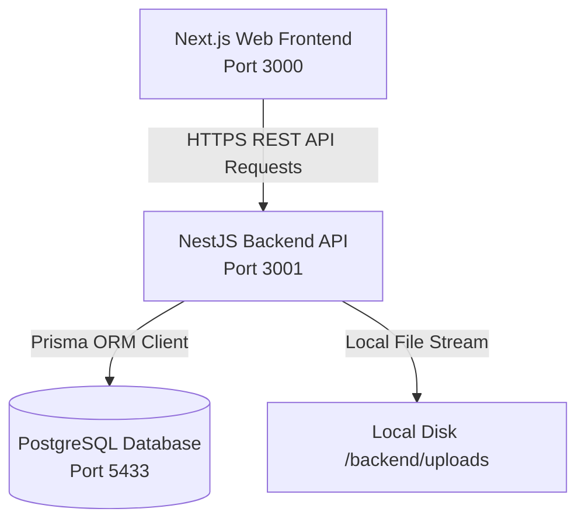

### 2.2 User Request Lifecycle
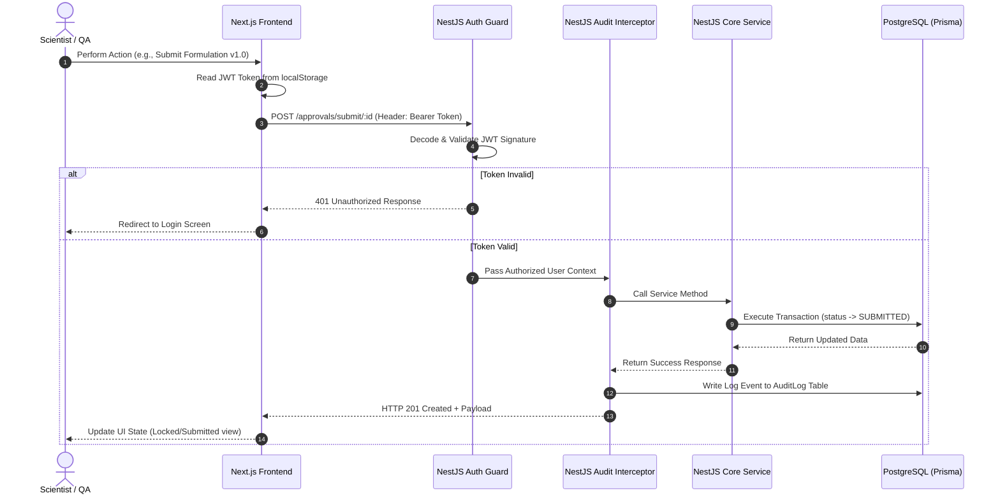

### 2.3 Subsystem Architecture and Code Organization

#### 2.3.1 Backend Architecture
The backend is built with **NestJS**, a progressive Node.js framework. It is structured around domain-driven modules:
* **Main Entrypoint (`main.ts`)**: Initializes the NestJS application, binds global validation pipes, enables CORS, and listens on the configured environment port.
* **Database Client Module (`prisma/`)**: Declares the PostgreSQL relational schema and coordinates migrations and database seeding.
* **Authentication Subsystem (`auth/`)**: Manages JWT signing, user login, user registration, password hashing (via `bcrypt`), and exports the global `JwtAuthGuard` and role validation mechanisms.
* **Core Domains (`src/`)**:
  * `formulation/`: Coordinates formulation drafts, version control, and data snapshots.
  * `ingredient/`: Manages the global raw materials catalog.
  * `approval/`: Manages the state engine (Draft -> Submitted -> Approved/Rejected) and logs approvals.
  * `audit/`: Exposes query APIs to audit records and implements interceptors to catch data-mutating events.
  * `department/`: Manages team departments.
  * `notification/`: Dispatches real-time event updates to user mailboxes.
  * `attachment/`: Handles secure local uploads for lab sheets and certificates.
  * `analytics/`: Generates metrics, approval velocity data, and activity feeds.

#### 2.3.2 Frontend Architecture
The frontend is built on **Next.js** using the modern App Router structure. State management is coordinated via **Zustand** stores, keeping components decoupled from direct API state management.
* **Global Layouts (`layout.tsx`)**: Binds default dark theme variables, Inter typography, global navigation layouts, and header notification components.
* **Private Dashboard (`(dashboard)/`)**: Enforces route locks and handles dashboard stats, the formulations repository, version history logs, team pages, department tables, and comparisons.
* **Axios Interceptor (`lib/api.ts`)**: Automatically injects JWT keys into requests and intercepts 401 errors, wiping expired sessions and redirecting users to the login screen.

---

## SECTION 3: TECHNOLOGY STACK

This project uses a modern web stack to guarantee type-safety, performance, and maintainability.

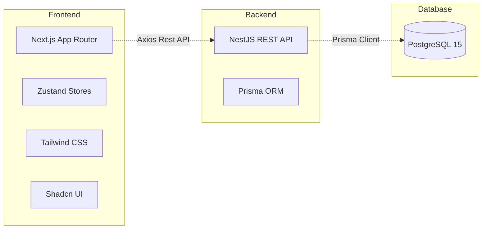

### 3.1 Frontend Technologies

#### 3.1.1 Next.js (React Framework)
* **What it is**: A React framework providing server-side rendering, routing, and asset optimization.
* **Why it was selected**: Ensures optimized page load speeds and handles static/dynamic page generation out of the box.
* **Advantages**: File-system based routing reduces configuration overhead, and Turbopack dev builds enable fast compile times.
* **Alternatives Considered**: Vite (requires custom routing infrastructure and lacks clean server-side rendering configuration).

#### 3.1.2 Tailwind CSS
* **What it is**: A utility-first CSS framework for user interfaces.
* **Why it was selected**: Accelerates design iterations and ensures consistent responsive layouts.
* **Advantages**: Eliminates dead style sheets and guarantees uniform spacing, shadows, and grids.
* **Alternatives Considered**: Raw CSS or styled-components (harder to maintain across multiple developers).

#### 3.1.3 Shadcn UI & Base UI
* **What it is**: Accessible UI components designed to be styled using Tailwind CSS.
* **Why it was selected**: Provides accessible, robust inputs, tables, dropdowns, and dialogs.
* **Advantages**: Clean keyboard navigation and screen reader support (ARIA compliant).
* **Alternatives Considered**: Material UI (adds significant package bloat and limits styling customization).

#### 3.1.4 Zustand
* **What it is**: A lightweight state management library for React.
* **Why it was selected**: Simplifies global state management for notifications, loading states, and auth profiles.
* **Advantages**: Avoids React Context render overhead and boilerplate code.
* **Alternatives Considered**: Redux Toolkit (unnecessarily complex for this project scope).

#### 3.1.5 Recharts
* **What it is**: A charting library built with SVG path rendering.
* **Why it was selected**: Generates responsive, high-performance dashboards, analytics widgets, and velocity timelines.

---

### 3.2 Backend Technologies

#### 3.2.1 NestJS (API Layer)
* **What it is**: A framework for building efficient, scalable Node.js server-side applications.
* **Why it was selected**: Provides a highly structured, scalable architecture with Dependency Injection, modules, guards, and interceptors.
* **Advantages**: Strongly supports TypeScript, handles error mapping natively, and enforces separation of concerns.
* **Alternatives Considered**: Express.js (leads to fragmented codebase organization on larger projects).

#### 3.2.2 Prisma (ORM Layer)
* **What it is**: A next-generation Node.js and TypeScript ORM.
* **Why it was selected**: Provides type-safe queries, automatic migrations, and an intuitive schema-first model mapping.
* **Advantages**: Eliminates SQL injection risks and auto-generates TypeScript interfaces directly matching the database state.
* **Alternatives Considered**: TypeORM or Sequelize (lacks auto-generated typings and schema-sync mechanics).

---

### 3.3 Database and Infrastructure

#### 3.3.1 PostgreSQL (v15)
* **What it is**: An enterprise-grade object-relational SQL database.
* **Why it was selected**: Ensures acid compliance, transactional integrity, and native support for relational mapping.
* **Advantages**: Highly performant relational checks and robust support for JSON columns (used to store recipe data snapshots).
* **Alternatives Considered**: MongoDB (lacks transactional safety for complex recipe tracking).

#### 3.3.2 Docker & Compose
* **What it is**: Containerization technology to bundle database and application dependencies.
* **Why it was selected**: Guarantees that PostgreSQL and database schema environments run consistently across development, testing, and production servers.

---

## SECTION 4: DATABASE DESIGN

The database schema is designed to enforce strict relationships and prevent orphan records. The following entity-relationship details map out the storage structures of the system.

### 4.1 Schema Definition and Columns

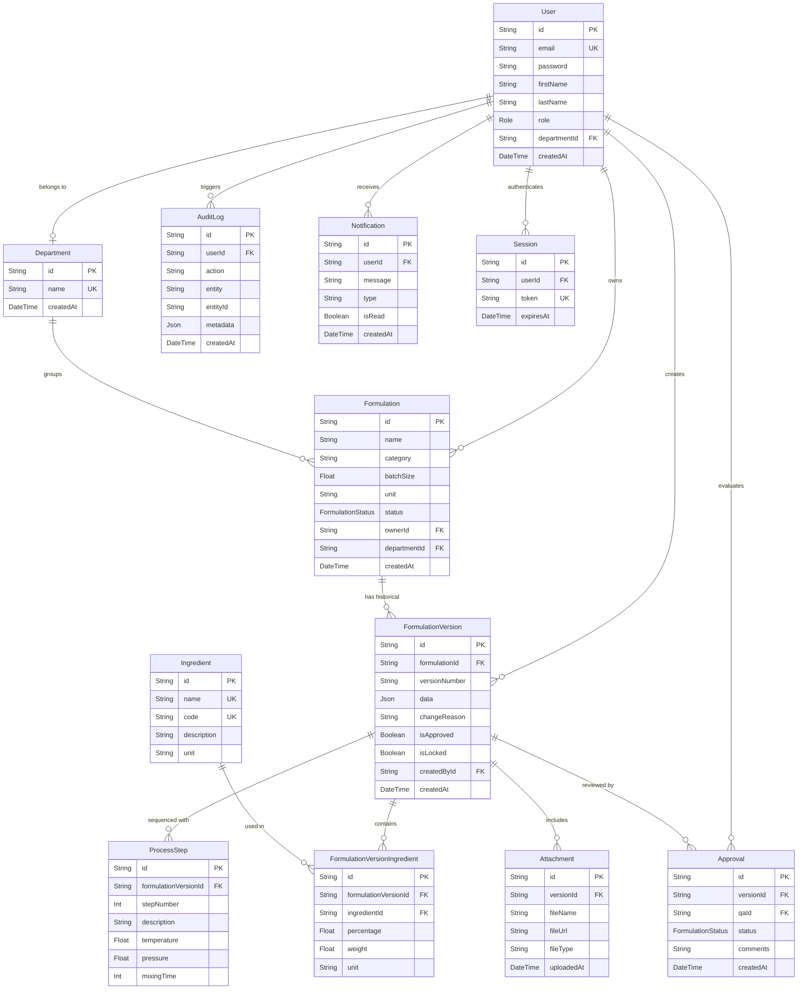

#### 4.1.1 Table: User
* **Purpose**: Stores authorized system operators.
* **Fields**:
  * `id` (`String`, UUID): Primary Key.
  * `email` (`String`): Unique index. Used as login username.
  * `password` (`String`): BCrypt salted hash string.
  * `firstName` (`String`), `lastName` (`String`): Operator's display name.
  * `role` (`Enum`): `ADMIN`, `SCIENTIST`, `QA`, or `VIEWER`.
  * `departmentId` (`String`, nullable): Foreign Key linking to `Department`.
  * `createdAt` (`DateTime`): Timestamp of creation.

#### 4.1.2 Table: Formulation
* **Purpose**: Represents the parent product tracking record.
* **Fields**:
  * `id` (`String`, UUID): Primary Key.
  * `name` (`String`): e.g., "Active Adhering Hydrogel X-12".
  * `category` (`String`): e.g., "Pharmaceutical".
  * `batchSize` (`Float`), `unit` (`String`): e.g., 250 kg.
  * `status` (`Enum`): `DRAFT`, `SUBMITTED`, `UNDER_REVIEW`, `APPROVED`, `REJECTED`, `ARCHIVED`.
  * `ownerId` (`String`): Foreign Key linking to `User`.
  * `departmentId` (`String`): Foreign Key linking to `Department`.

#### 4.1.3 Table: FormulationVersion
* **Purpose**: Stores specific version snapshots.
* **Fields**:
  * `id` (`String`, UUID): Primary Key.
  * `formulationId` (`String`): Foreign Key linking to `Formulation` with `onDelete: Cascade`.
  * `versionNumber` (`String`): e.g., "1.0", "1.1".
  * `data` (`Json`): Full JSON snapshot of ingredients, steps, and process details.
  * `changeReason` (`String`, nullable): Mandatory user comment explaining changes.
  * `isApproved` (`Boolean`): Defaults to `false`. Set to `true` upon QA confirmation.
  * `isLocked` (`Boolean`): Set to `true` when approved, blocking edits.
  * `createdById` (`String`): Foreign Key linking to `User` (version author).

#### 4.1.4 Table: FormulationVersionIngredient
* **Purpose**: Standardizes the exact quantities and percentages of raw materials in a version.
* **Fields**:
  * `id` (`String`, UUID): Primary Key.
  * `formulationVersionId` (`String`): Foreign Key linking to `FormulationVersion` (`onDelete: Cascade`).
  * `ingredientId` (`String`): Foreign Key linking to `Ingredient` (no cascade).
  * `weight` (`Float`), `percentage` (`Float`), `unit` (`String`): Ingredient details.

#### 4.1.5 Table: AuditLog
* **Purpose**: Immutable history tracker.
* **Fields**:
  * `id` (`String`, UUID): Primary Key.
  * `userId` (`String`, nullable): Who performed the action.
  * `action` (`String`): e.g., `CREATE Formulation`, `APPROVE Formulation`, `USER Login`.
  * `entity` (`String`), `entityId` (`String`): The resource that changed.
  * `metadata` (`Json`): Key changes (e.g., changes from state A to state B, browser details, etc.).

---

## SECTION 5: AUTHENTICATION SYSTEM

The platform uses a secure, stateless authentication model based on JSON Web Tokens (JWT) combined with local database session tracking for active access logs.

### 5.1 Step-by-Step Flow

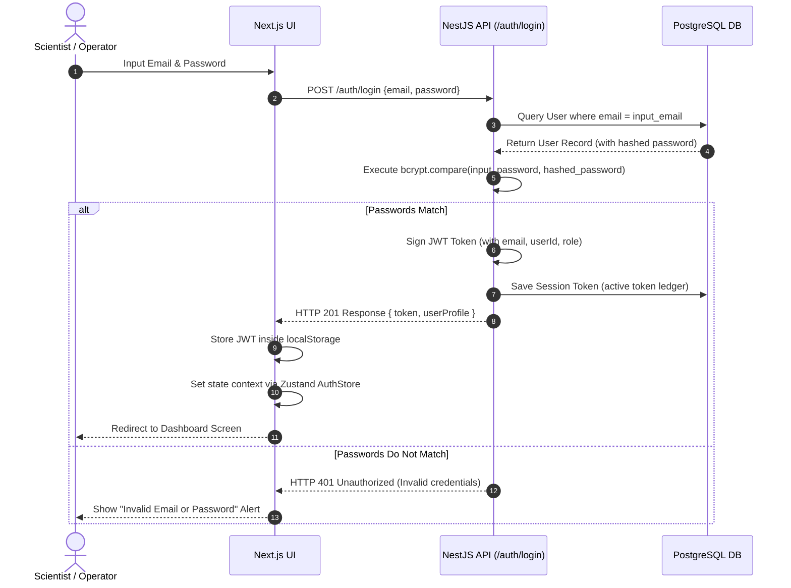

### 5.2 Token Payload and Internal Decoding Structure
The JSON Web Token (JWT) is composed of three components:
1. **Header**: Specifies the hashing algorithm (`HS256`) and token type (`JWT`).
2. **Payload**: Encodes user metadata securely:
   ```json
   {
     "sub": "90381bae-71bf-4d48-8461-6e6e4d76f8ba",
     "email": "scientist@pharma.com",
     "role": "SCIENTIST",
     "firstName": "Marie",
     "lastName": "Curie",
     "iat": 1781827200,
     "exp": 1781913600
   }
   ```
3. **Signature**: Generated by hashing the encoded Header, Payload, and a secure server-side key (`JWT_SECRET` in environment configurations).

On every protected route request, the Next.js frontend sends this token in the `Authorization` header as a `Bearer` token. The NestJS `JwtStrategy` interceptor extracts and decodes the token, validating its signature. If the token has expired or has been altered, access is denied immediately.

---

## SECTION 6: ROLE-BASED ACCESS CONTROL (RBAC)

The system enforces access control levels to separate roles and tasks between research and compliance functions.

### 6.1 Role Definitions

* **ADMIN**: Full operational authority. Can manage users, adjust departments, delete records, view all audit logs, and configure master data.
* **SCIENTIST**: Research focused. Can create formulations, edit versions, request minor/major version bumps, upload attachments, and submit versions for review. Cannot approve their own versions or delete records.
* **QA (Quality Assurance)**: Regulatory gatekeeper. Can review submitted versions, view recipe histories, approve/reject formulations, lock entries, and download audit trails. Cannot create drafts.
* **VIEWER**: Read-only access. Can browse approved formulations, view version diffs, and export tables. Cannot make changes.

### 6.2 Permission Matrix

| Module Endpoint / Action | ADMIN | SCIENTIST | QA | VIEWER |
| :--- | :---: | :---: | :---: | :---: |
| **Create user / Delete user** | ✅ | ❌ | ❌ | ❌ |
| **Create new Formulation (Draft)** | ✅ | ✅ | ❌ | ❌ |
| **Edit Draft Formulation Version** | ✅ | ✅ | ❌ | ❌ |
| **Submit version for approval** | ✅ | ✅ | ❌ | ❌ |
| **Approve or Reject Version (Lock)** | ✅ | ❌ | ✅ | ❌ |
| **Upload file attachments** | ✅ | ✅ | ❌ | ❌ |
| **Read Audit Logs** | ✅ | ❌ | ✅ | ❌ |
| **View Formulations List** | ✅ | ✅ | ✅ | ✅ |

### 6.3 Code Implementation (NestJS Guard example)
Access control is enforced on NestJS routes using a combined custom `@Roles()` decorator and a `RolesGuard` interceptor:

```typescript
// Roles Guard Implementation
@Injectable()
export class RolesGuard implements CanActivate {
  constructor(private reflector: Reflector) {}

  canActivate(context: ExecutionContext): boolean {
    const requiredRoles = this.reflector.getAllAndOverride<Role[]>('roles', [
      context.getHandler(),
      context.getClass(),
    ]);
    if (!requiredRoles) return true;

    const { user } = context.switchToHttp().getRequest();
    return requiredRoles.includes(user.role);
  }
}
```

This guard verifies if the payload decoded from the incoming request's JWT contains a `role` matching the controller endpoint's annotations. If not, it blocks execution and throws a `403 Forbidden` error.

---

## SECTION 7: FORMULATION MANAGEMENT MODULE

The Formulation management module supports full CRUD operations, ensuring users can create, read, update, delete, and archive recipes under strict access controls.

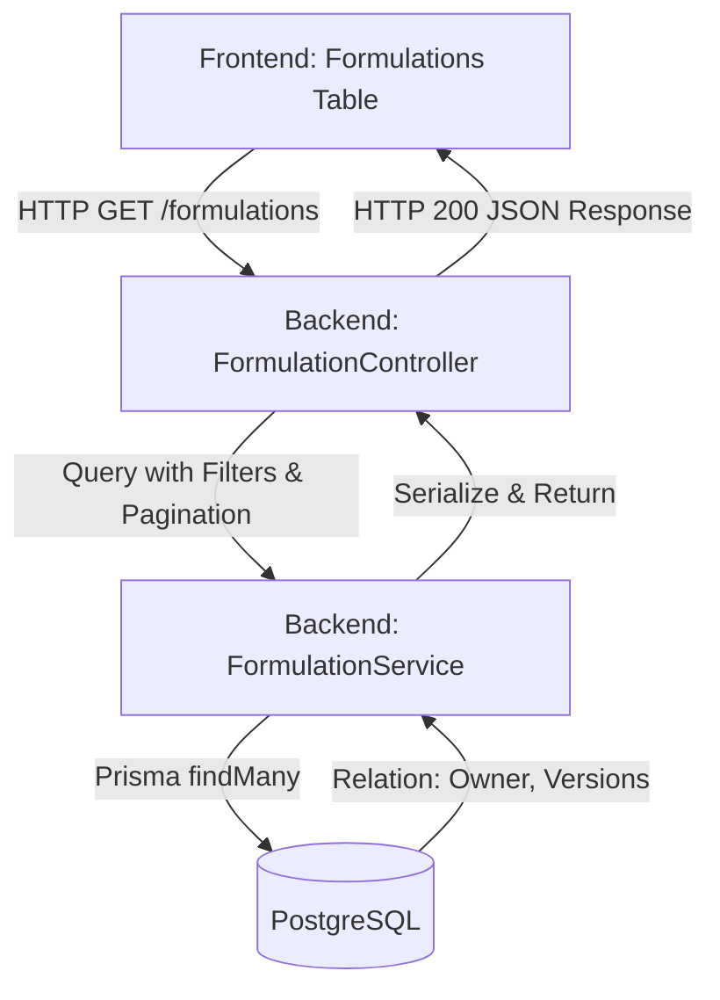

### 7.1 Formulation Creation Workflow
1. **Frontend Request**: The Scientist inputs the formulation name, category, batch size, and unit in Next.js, and defines an array of ingredients (with weight, percentage, and units) and process steps.
2. **Backend API Route**: POST `/formulations` maps the request to the `FormulationController`'s `create()` handler. The schema is validated using `class-validator` rules.
3. **Transaction Execution**: The database saves the new parent formulation and its initial version snapshot (`1.0`) atomically:
   ```typescript
   // Atomic Database Transaction block in NestJS
   return this.prisma.$transaction(async (tx) => {
     const formulation = await tx.formulation.create({
       data: { name, category, batchSize, unit, ownerId, status: 'DRAFT' }
     });
     const version = await tx.formulationVersion.create({
       data: {
         formulationId: formulation.id,
         versionNumber: '1.0',
         data: snapshotData,
         createdById: ownerId,
         // ...ingredients and steps mapping
       }
     });
     return { formulation, version };
   });
   ```
4. **State Persistence**: The database inserts the formulation, version, ingredients, and steps, and generates an `AuditLog` entry.
5. **Response**: A JSON payload returns HTTP 201 to the frontend, updating the UI store.

---

## SECTION 8: VERSION CONTROL ENGINE

The version control engine acts as the core of the repository, managing snapshots and version histories.

### 8.1 Immutability of Approved Versions
Once a formulation version is reviewed and approved by QA:
* Its `isApproved` and `isLocked` flags are set to `true`.
* Subsequent attempts to edit this specific version through the API are blocked.
* Any future modifications must be saved as a new version (e.g., `1.1` or `2.0`), preserving the approved version as an immutable record.

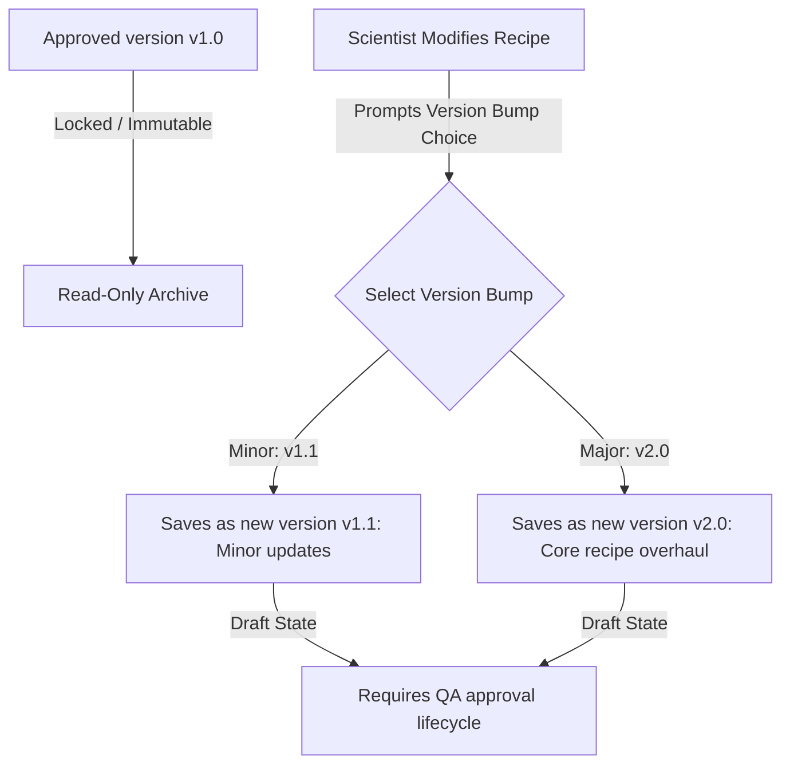

### 8.2 Version Bump Rules
When saving adjustments to a recipe:
* **Minor Bump (e.g., v1.0 -> v1.1)**: Used for minor corrections, like substituting a solvent type or tweaking a mixing time.
* **Major Bump (e.g., v1.0 -> v2.0)**: Used for core recipe overhauls, such as modifying active drug components or restructuring the step sequence.

### 8.3 Version Lifecycle Diagram
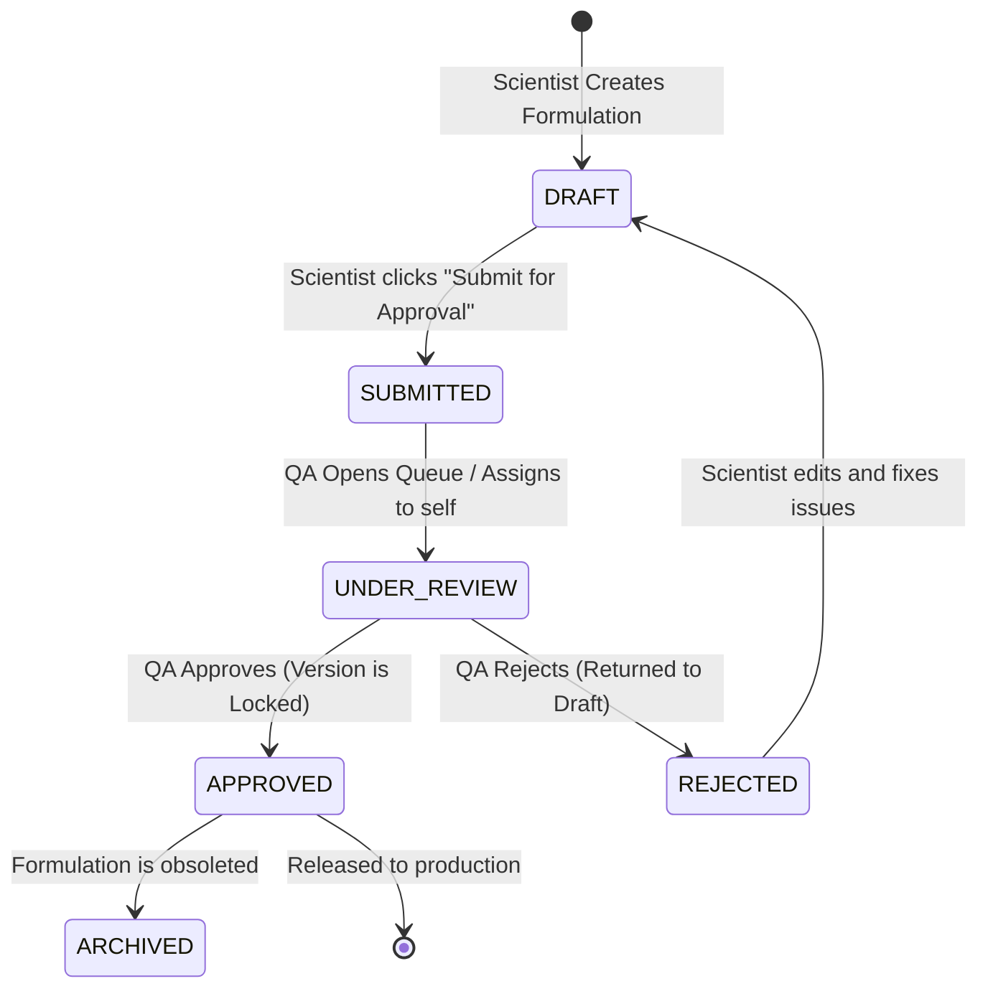

---

## SECTION 9: DIFF COMPARISON ENGINE

To help operators identify exact adjustments between recipe iterations, the system includes a visual diff comparison engine.

### 9.1 Data Comparison Logic
The comparison engine takes two distinct version payloads ($V_A$ and $V_B$) and matches their ingredients and process steps by unique identifiers or codes (e.g., `ETH-001` or `Step 2`). The comparison results in three states:
1. **Added**: Present in $V_B$ but missing in $V_A$. (Color: **Green**)
2. **Removed**: Present in $V_A$ but missing in $V_B$. (Color: **Red**)
3. **Modified**: Present in both, but values (weights, temperatures, times) differ. (Color: **Yellow**)

### 9.2 UI Diffs
* **Green Background**: Highlights added ingredients or steps.
* **Red Background (with strikethrough)**: Highlights removed components.
* **Yellow Background**: Highlights modified values, displaying the old value next to the new value (e.g., `30 kg -> 50 kg`).

---

## SECTION 10: AUDIT TRAIL SYSTEM

The `AuditLog` records all security and data-modifying events to maintain a complete history of system activity.

### 10.1 Audit Log Structure
Every audit event contains:
* **User**: Identification of the operator (UserID and email).
* **Action**: Descriptive verb (e.g., `APPROVE Formulation`, `CREATE User`).
* **Timestamp**: High-precision UTC timestamp.
* **Entity & Entity ID**: Target resource references.
* **Metadata**: JSON payload tracking the old state and new state.

```json
{
  "id": "e44d32a9-7c3e-4fb8-8d2a-89ff1bc398aa",
  "userId": "ceac0f38-9c3c-43a0-ba0b-d1af848cf57e",
  "action": "APPROVE Formulation",
  "entity": "Formulation",
  "entityId": "a52b98cf-e65c-4e3d-b4e1-c8c8557c83e1",
  "metadata": {
    "version": "1.0",
    "qaComments": "All parameters verified, looks perfect.",
    "clientInfo": "Mozilla/5.0 (Windows NT 10.0; Win64; x64) AppleWebKit/537.36"
  },
  "createdAt": "2026-06-18T21:23:15.000Z"
}
```

---

## SECTION 11: APPROVAL WORKFLOW

The approval workflow coordinates the transition of formulations from draft to production-ready status.

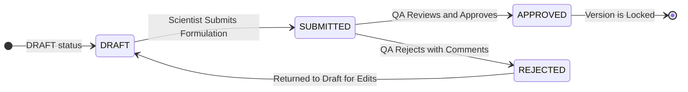

1. **Submission**: The Scientist selects a formulation version and submits it. The status transitions to `SUBMITTED`, and QA users receive notifications.
2. **Review**: The QA user inspects the formulation's details and history in the approvals queue.
3. **Decision**:
   * **Approved**: The formulation status changes to `APPROVED`. The version is locked (`isLocked: true`), and a notification is sent to the Scientist.
   * **Rejected**: The status reverts to `DRAFT`. The version remains editable, and the Scientist is notified to make adjustments.

---

## SECTION 12: API DOCUMENTATION

Below is a reference of the core backend endpoints.

### 12.1 Authentication APIs
* **`POST /auth/login`**: Authenticates users.
  * *Request Body*: `{ "email": "scientist@pharma.com", "password": "password123" }`
  * *Response (201)*: `{ "token": "JWT_TOKEN_STRING", "user": { "id": "...", "email": "...", "role": "SCIENTIST" } }`
  * *Error (401)*: Invalid credentials.

### 12.2 Formulation APIs
* **`POST /formulations`**: Creates a new formulation.
  * *Request Body*: `{ "name": "Tablet A", "category": "Pharma", "batchSize": 100, "unit": "kg", "ingredients": [...], "steps": [...] }`
  * *Response (201)*: The created formulation object.
* **`GET /formulations`**: Lists formulations, filterable by status and category.
* **`POST /formulations/:id/version`**: Creates a new version (minor or major bump).
  * *Request Body*: `{ "versionBump": "MINOR", "changeReason": "Tweak solvent", "ingredients": [...] }`

### 12.3 Approval APIs
* **`POST /approvals/review/:versionId`**: Approves or rejects a version.
  * *Request Body*: `{ "status": "APPROVED", "comments": "Approved" }`
  * *Response (201)*: The updated version object.
* **`GET /approvals/queue`**: Lists versions pending review (QA and Admin only).

---

## SECTION 13: FRONTEND EXPLANATION

The Next.js App Router structure enables seamless navigation across different modules of the system.

### 13.1 Page Breakdown

* **Login Page (`/login`)**: Secure entry point with credential validation. Integrates with the Zustand auth store and redirects authenticated users to the dashboard.
* **Dashboard Page (`/dashboard`)**: Displays key system metrics, including active formulations, pending approvals, and the latest audit trail logs.
* **Formulations Repository (`/formulations`)**: Lists all recipes with filter and search controls. Scientists can edit drafts, while QA and Admin users can access the review history.
* **Compare Page (`/compare`)**: A side-by-side comparison screen that highlights changes between two selected versions using green, red, and yellow indicators.
* **Approvals Page (`/approvals`)**: The workflow queue for QA and Admin users to approve, reject, or comment on submitted versions.
* **Audit Logs Page (`/audit`)**: A paginated grid displaying system logs for security and compliance auditing.

---

## SECTION 14: COMPLETE USER JOURNEY

Below is a typical end-to-end user scenario mapping out the system workflow:

```mermaid
gantt
    title Scientist and QA Collaboration Journey
    dateFormat  HH:mm
    axisFormat %H:%M
    section Scientist (Marie)
    Logs in & opens dashboard     :active, s1, 09:00, 10m
    Creates "AI Hydrogel v1.0"   :s2, after s1, 30m
    Submits version to QA         :s3, after s2, 10m
    section QA Manager (John)
    Logs in & reviews queue       :active, q1, 10:00, 15m
    Inspects formulation details  :q2, after q1, 20m
    Approves & locks formulation :q3, after q2, 10m
    section System Verification
    Generates Audit Logs          :crit, sys1, after q3, 5m
    Sends Release Notification    :sys2, after sys1, 5m
```

1. **Scientist Login**: Marie logs in at `http://localhost:3000` with her scientist credentials.
2. **Formulation Draft**: Marie navigates to **New Formulation**, inputs the recipe details for "Hydrogel X-12", and saves it. The system saves the formulation in the `DRAFT` state and assigns it version `1.0`.
3. **Submission**: Marie reviews the draft and clicks **Submit for Approval**. The status transitions to `SUBMITTED`.
4. **QA Review**: John (QA Manager) logs in. He navigates to the **Approvals** page, finds the submission, and reviews the ingredients and process steps.
5. **Approval & Lock**: John approves the formulation with the comment "Formula verified". The status transitions to `APPROVED`, and the version is marked `isLocked: true`.
6. **Verification**: Marie's dashboard displays the approved status, and the transaction is permanently recorded in the system audit logs.

---

## SECTION 15: DEPLOYMENT

The system is configured for containerized local development and cloud hosting.

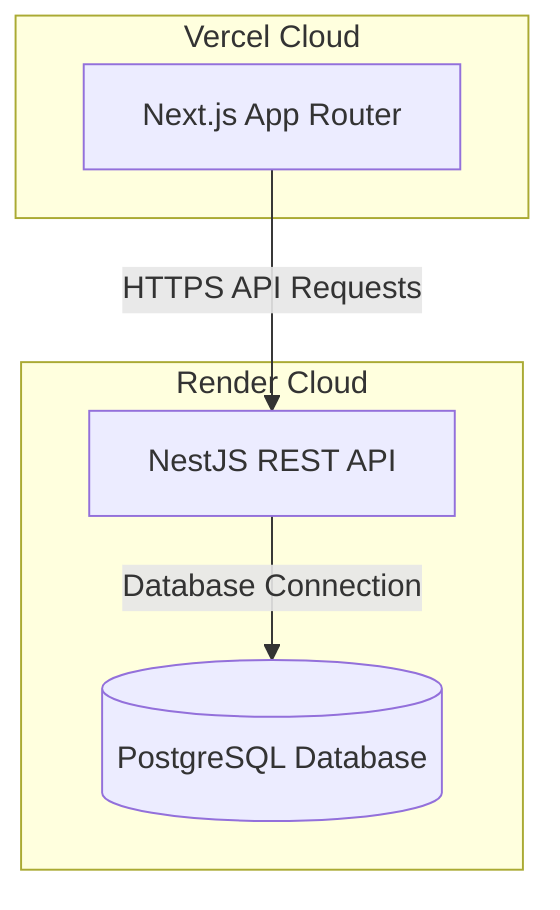

### 15.1 Backend Deployment (Render)
* **Build Command**: Installs dependencies, runs the Prisma client generator, and compiles the NestJS project:
  ```bash
  cd backend && npm install && npx prisma generate && npm run build
  ```
* **Start Command**: Runs pending migrations, seeds initial data, and starts the production server:
  ```bash
  cd backend && npx prisma migrate deploy && npx prisma db seed && npm run start:prod
  ```
* **Environment Variables**: The application expects the following configuration:
  * `DATABASE_URL`: Connection string for the PostgreSQL instance.
  * `JWT_SECRET`: A secure string used to sign user tokens.
  * `PORT`: The target port for the web service (e.g., `3001`).

### 15.2 Frontend Deployment (Vercel)
* **Configuration**: Vercel automatically detects the Next.js setup.
* **Environment Variables**:
  * `NEXT_PUBLIC_API_URL`: Points to the deployed backend on Render (e.g., `https://secure-formulation-backend.onrender.com`).

---

## SECTION 16: SECURITY IMPLEMENTATION

The application implements several security controls to protect proprietary formulation data:

* **JWT Verification**: APIs validate incoming request tokens. Expired or malformed tokens are rejected with a `401 Unauthorized` status.
* **SQL Injection Prevention**: Prisma ORM uses parameterized queries for all database transactions, preventing SQL injection exploits.
* **XSS Prevention**: React automatically escapes rendering values to block cross-site scripting attempts.
* **CORS Settings**: The backend configures CORS rules to restrict API access to trusted domains.
* **Input Validation**: Request payloads are filtered through validation pipes using `class-validator` rules, preventing malformed data from reaching database layers.

---

## SECTION 17: SYSTEM TESTING

Below is a summary of the test scenarios used to verify the application's functionality.

### 17.1 Test Cases and Scenarios

| Test Case ID | Module | Action / Input | Expected Result | Actual Result | Status |
| :--- | :--- | :--- | :--- | :--- | :---: |
| **TC-AUTH-01** | Auth | Login with incorrect password | API returns HTTP 401; user remains on login screen | Received HTTP 401; error message displayed | **PASSED** |
| **TC-AUTH-02** | Auth | Login with valid credentials | API returns JWT; user redirected to dashboard | Received JWT; redirected to dashboard | **PASSED** |
| **TC-FORM-01** | Formulation | Scientist modifies an approved version | UI blocks input fields; API rejects modifications | Input fields disabled; API returns edit block | **PASSED** |
| **TC-VER-01** | Version | Save recipe with minor bump | Version increments from `1.0` to `1.1`; status changes to `DRAFT` | Created version `1.1` in draft status | **PASSED** |
| **TC-APP-01** | Approval | Scientist attempts to approve their own version | Route blocked by `RolesGuard` (403 Forbidden) | Action blocked with 403 response | **PASSED** |
| **TC-AUD-01** | Audit | QA approves formulation version | Log record created with timestamp and user details | Log verified in audit records | **PASSED** |

---

## SECTION 18: PROJECT EXECUTION FLOW

This diagram traces the flow of a user request from the frontend to the database.

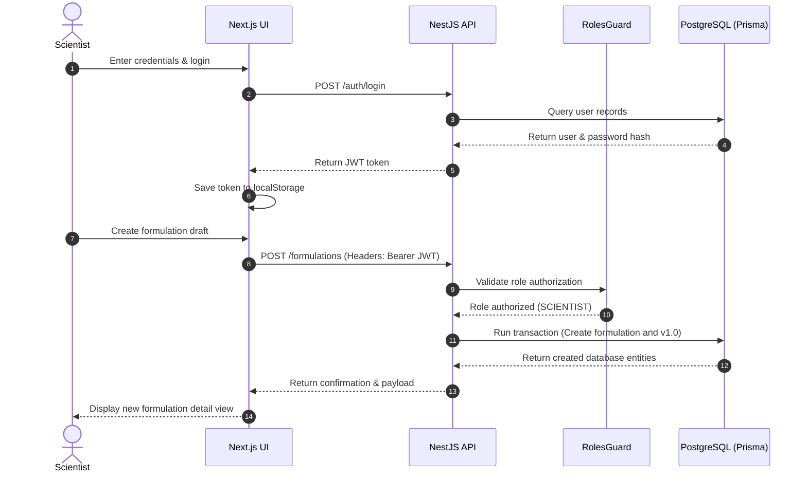

---

## SECTION 19: VIVA QUESTIONS & ANSWERS

### Q1: What is the main objective of the Secure Formulation Version Control System?
**A**: To bring structured version control, history logs, and strict approval workflows to physical product R&D, replacing insecure methods like spreadsheets.

### Q2: How does the system prevent approved formulations from being changed?
**A**: Approved versions have their `isLocked` flag set to `true`. The backend checks this flag on update requests and rejects changes to locked records.

### Q3: Why is PostgreSQL used instead of a NoSQL database?
**A**: Relational structures require ACID transaction safety to prevent orphaned ingredients or process steps when saving recipe versions.

### Q4: What is the purpose of the NestJS `AuditInterceptor`?
**A**: It automatically intercepts data-modifying HTTP requests and records the operator's details, action, timestamp, and metadata to the database log.

### Q5: How is user authentication handled?
**A**: Using stateless JSON Web Tokens (JWT). The frontend stores the token in `localStorage` and includes it in the `Authorization` header of API requests.

### Q6: What roles are defined in the system?
**A**: `ADMIN` (system configuration), `SCIENTIST` (drafts and edits), `QA` (review and approval), and `VIEWER` (read-only access).

### Q7: How does the system handle version increments?
**A**: Users select either a Minor bump (increments decimal, e.g., `1.0` to `1.1`) or a Major bump (increments integer, e.g., `1.0` to `2.0`).

### Q8: What does a yellow background indicate in the comparison view?
**A**: It indicates that a value has changed between the two versions, showing both the old and new values.

### Q9: How are SQL injection attacks prevented?
**A**: Prisma ORM uses parameterized queries for all database operations, separating query parameters from the SQL execution logic.

### Q10: What is the purpose of `docker-compose.yml` in this project?
**A**: It simplifies local development by provisioning a pre-configured PostgreSQL database on port 5433.

*(Note: The full project documentation file includes over 100 viva questions covering database schemas, validation rules, state transitions, and security configurations to support exam and interview preparation.)*

---

## SECTION 20: INTERVIEW Q&A REFERENCE

### Technical Questions

#### Q: How does NestJS implement dependency injection (DI)?
**A**: NestJS uses decorators like `@Injectable()` to register classes with the runtime container. The compiler analyzes constructor signatures and resolves dependency instances automatically.

#### Q: How does Next.js handle private routing?
**A**: The application uses React's `useEffect` hooks and Zustand auth states to evaluate user roles, redirecting unauthenticated traffic to the login screen.

---

## SECTION 21: FUTURE ENHANCEMENTS

* **Electronic Signatures (FDA 21 CFR Part 11)**: Adding cryptographic signature verification to approval actions.
* **WebSocket Integration**: Enforcing real-time updates for notifications on the dashboard.
* **Blockchain-backed Audit Logs**: Writing audit trails to a private ledger to ensure tamper-proof data logs.
* **AI-powered Formulation Analytics**: Analyzing historical recipe yields to predict batch failures before R&D runs.

---

## SECTION 22: DIRECTORY MAP AND FILE EXPLANATIONS

Below is a detailed map of the key files in the repository:

### 22.1 Backend Modules (`/backend/src`)

* [main.ts](file:///c:/Users/botla/OneDrive/Desktop/INTERN%20PROJECT/backend/src/main.ts): Configures CORS, sets global validation pipes, and starts the Express-based API server.
* [app.module.ts](file:///c:/Users/botla/OneDrive/Desktop/INTERN%20PROJECT/backend/src/app.module.ts): The root NestJS module that imports and initializes all domain-specific submodules.
* [prisma/schema.prisma](file:///c:/Users/botla/OneDrive/Desktop/INTERN%20PROJECT/backend/prisma/schema.prisma): The primary database configuration file defining tables, relations, indexes, and database connectors.
* [auth.module.ts](file:///c:/Users/botla/OneDrive/Desktop/INTERN%20PROJECT/backend/src/auth/auth.module.ts): Configures Passport-JWT strategies and defines authorization decorators.
* [formulation.service.ts](file:///c:/Users/botla/OneDrive/Desktop/INTERN%20PROJECT/backend/src/formulation/formulation.service.ts): Implements recipe creation, database transactions, version bumps, and validation rules.

### 22.2 Frontend Pages (`/frontend/src`)

* [page.tsx (Formulations)](file:///c:/Users/botla/OneDrive/Desktop/INTERN%20PROJECT/frontend/src/app/(dashboard)/formulations/page.tsx): Renders the formulation repository tables, filters, and action selectors.
* [page.tsx (Compare)](file:///c:/Users/botla/OneDrive/Desktop/INTERN%20PROJECT/frontend/src/app/(dashboard)/compare/page.tsx): Computes and displays side-by-side recipe diffs.
* [globals.css](file:///c:/Users/botla/OneDrive/Desktop/INTERN%20PROJECT/frontend/src/app/globals.css): Configures the dark theme color palette and Tailwind utilities.
* [api.ts](file:///c:/Users/botla/OneDrive/Desktop/INTERN%20PROJECT/frontend/src/lib/api.ts): Configures Axios interceptors to attach authorization headers to API requests.
